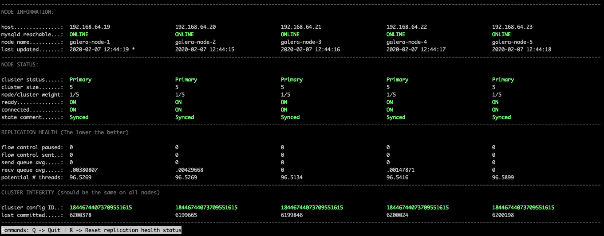

 

galera-status
=============

Monitor status and health of all nodes of a Galera cluster

    USAGE: galera-status [--help] [--follow] [--hosts=<node1>,<node2>,...] [MySQL options]

    OPTIONS: --help        this help
             --follow      continuously updates information retrieved from monitored nodes
             --hosts       comma-separated list of node hosts

    EXAMPLES: galera-status --hosts=172.0.0.1,172.0.0.2,172.0.0.3 -uuser -psecret --follow
              galera-status --follow

By default galera-status will try to resolve the list of hosts, username and password from
the local configuration when running on one of the cluster nodes. If you're using another
sst-method than xtrabackup or mariabackup, you have to specify username and password
manually.
If you're running the script from another machine, you can specify the list of hosts using
the --hosts parameter.

During follow-mode you can press 'r' to reset the cluster's replication health status
or 'q' to quit the script. You can also change a node's weight by pressing 'w', if the 
database account used has the privilege to change global variables. When chaning a node's
weight, the script asks for the node's index and new weight. The first node has the index
**0**, the second node hast the index **1** and so on. The node's weight must be specified
as integer value >= 0.

# Screenshot

Based on:
* http://www.codership.com/wiki/doku.php?id=monitoring 
* https://github.com/fridim/galera-status
